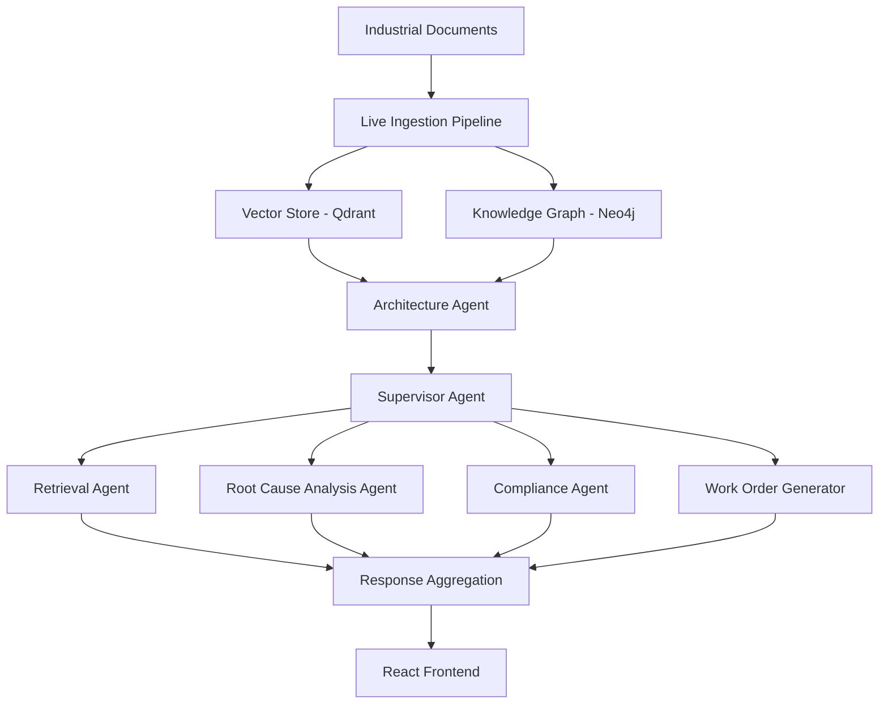

<h1 align="center">STRATA</h1>

<p align="center">
  <strong>Industrial Knowledge Intelligence Platform</strong>
</p>

<p align="center">
Transforming industrial knowledge into actionable intelligence using Hybrid RAG, Knowledge Graphs, and AI Agent Orchestration.
</p>

<p align="center">
  
  
  
  
  
  
</p>

---

STRATA is an AI-powered Industrial Knowledge Intelligence Platform that transforms engineering documents into an interconnected knowledge ecosystem. By combining **Hybrid Retrieval-Augmented Generation (Hybrid RAG)**, a **Neo4j Knowledge Graph**, **Qdrant Vector Search**, and a **hierarchical multi-agent architecture**, STRATA enables engineers to retrieve accurate information, perform Root Cause Analysis (RCA), verify compliance, and automatically generate maintenance work orders.

---

# Problem Statement

Industrial facilities generate thousands of engineering drawings, maintenance manuals, inspection reports, operating procedures, incident reports, and compliance documents. These documents are often scattered across multiple systems, making information retrieval slow, inconsistent, and highly dependent on domain experts.

STRATA converts these unstructured documents into a connected semantic knowledge base that combines vector search, knowledge graphs, and AI agents to deliver accurate, cited, and actionable answers in seconds.

---

# System Architecture



## Architecture Overview

```
Industrial Documents
        │
        ▼
Live Ingestion Pipeline
        │
 ┌──────┴──────────────┐
 │                     │
 ▼                     ▼
Vector Store      Knowledge Graph
 (Qdrant)             (Neo4j)
        │              │
        └──────┬───────┘
               ▼
      Architecture Agent
               ▼
        Supervisor Agent
               │
 ┌─────────────┼─────────────┬─────────────┬─────────────────┐
 │             │             │             │
 ▼             ▼             ▼             ▼
Retrieval     RCA      Compliance   Work Order
 Agent        Agent       Agent      Generator
               │
               └─────────────┬───────────────────────────────┐
                             ▼
                  Response Aggregation Layer
                             ▼
                    React Frontend (Streaming UI)
```

---

# Key Features

- Live ingestion of industrial documents (PDF, DOCX, engineering reports, SOPs).
- AI-powered entity and relationship extraction.
- Hybrid Retrieval combining semantic vector search with graph traversal.
- Neo4j Knowledge Graph for industrial asset relationships.
- Architecture Agent orchestrating the complete workflow.
- Supervisor Agent for intelligent task routing.
- Retrieval Agent with evidence-backed answers.
- Root Cause Analysis (RCA) Agent.
- Compliance verification against standards and procedures.
- Automated Work Order generation as structured JSON and professional PDF.
- Streaming conversational interface with persistent chat history.

---

# Technology Stack

### Backend
- Python
- FastAPI
- Neo4j
- Qdrant
- MongoDB
- ReportLab
- Sentence Transformers

### Frontend
- React
- Vite
- TypeScript
- Tailwind CSS

### AI
- Grok API
- Hybrid RAG
- Multi-Agent Orchestration
- Knowledge Graph

---

# Repository Structure

```text
agents/
api/
graph/
ingestion/
retrieval/
frontend/
generated/
corpus/
tests/

requirements.txt
README.md
```

---

# Prerequisites

- Python 3.10+
- Node.js 18+
- MongoDB
- Neo4j
- Qdrant (optional; in-memory fallback supported)

---

# Installation

## Backend

```bash
python -m venv .venv

# Windows
.venv\Scripts\activate

# Linux/macOS
source .venv/bin/activate

pip install -r requirements.txt

uvicorn api.main:app --reload
```

## Frontend

```bash
cd frontend
npm install
npm run dev
```

---

# Configuration

Create a `.env` file.

| Variable | Description | Required |
|-----------|-------------|----------|
| XAI_API_KEY | Grok API key | Yes |
| XAI_BASE_URL | API endpoint | No |
| XAI_MODEL | LLM model | No |
| XAI_VISION_MODEL | Vision model | No |
| QDRANT_URL | Qdrant endpoint | Optional |
| QDRANT_API_KEY | Qdrant Cloud API key | Optional |
| QDRANT_COLLECTION | Collection name | Optional |
| EMBEDDING_MODEL | Embedding model | Optional |
| NEO4J_URI | Neo4j URI | Optional |
| NEO4J_USER | Neo4j username | Optional |
| NEO4J_PASSWORD | Neo4j password | Optional |
| MONGO_URL | MongoDB connection | Required for persistent chat history |

---

# Example Workflow

1. Upload engineering documents.
2. Run the live ingestion pipeline.
3. Populate the vector index and knowledge graph.
4. The Architecture Agent coordinates the workflow.
5. The Supervisor Agent selects the appropriate specialist agents.
6. Specialist agents retrieve evidence, perform RCA, verify compliance, or generate work orders.
7. The Response Aggregation Layer combines the outputs.
8. Results are streamed to the React frontend with citations.

---

# API Examples

```bash
# Build the knowledge base
curl -X POST http://localhost:8000/ingest

# Ask a question
curl -X POST http://localhost:8000/api/chat \
-H "Content-Type: application/json" \
-d '{"query":"Explain the maintenance history of Pump P-101"}'

# Generate a work order
curl -X POST http://localhost:8000/api/work-order \
-H "Content-Type: application/json" \
-d '{"equipment_tag":"P-101","description":"Replace mechanical seal"}'
```

---

# Screenshots

Add screenshots or GIFs here.

```
docs/images/dashboard.png
docs/images/chat.png
docs/images/knowledge_graph.png
docs/images/work_order.png
```

---

# Future Enhancements

- Authentication & RBAC
- Docker Compose deployment
- Kubernetes support
- Additional document parsers
- Multiple LLM providers
- Advanced analytics dashboard
- Real-time industrial monitoring integrations

---

# Contributing

Contributions are welcome. Please open an issue before submitting major changes.

---

---

# License

This project is licensed under the **MIT License**.

See the [LICENSE](LICENSE) file for more details.
